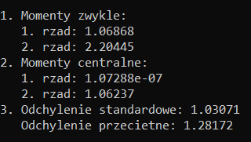

# StatystykaMatematyczna

This code is a C++ program that calculates various statistical moments and measures of dispersion for a given set of data.
The program reads data from a file named "FileIn.txt" and performs calculations using the data.

## Dependencies
This code requires the C++ standard library, which includes the following header files:
- `<iostream>`
- `<fstream>`
- `<cmath>`
- `<vector>`

## Functions

### obliczMoment
```cpp
float obliczMoment(const std::vector<float>& dane, int rzad)
```
- Calculates the ordinary moment of a given order (`rzad`) for the data stored in the `dane` vector.
- Returns the calculated moment value.
### obliczMomentCentralny
```cpp
float obliczMomentCentralny(const std::vector<float>& dane, int rzad)
```
- Calculates the central moment of a given order (`rzad`) for the data stored in the `dane` vector.
- Uses the `obliczMoment` function to calculate the first ordinary moment.
- Returns the calculated central moment value.

### obliczOdchyleniePrzecietne
```cpp
float obliczOdchyleniePrzecietne(const std::vector<float>& dane)
```
- Calculates the mean absolute deviation for the data stored in the `dane` vector.
- Uses the `obliczMoment` function to calculate the first, second, and third ordinary moments.
- Returns the calculated mean absolute deviation value.

## Main

The main is the entry point of the program. It performs the following steps:

1. Opens the file named "FileIn.txt" using an input file stream (`std::ifstream`).
2. Initializes a vector named `dane` to store the data read from the file.
3. Reads 100 floating-point values from the file and adds them to the `dane` vector.
4. Closes the input file stream.
5. Calculates the ordinary and central moments using the `obliczMoment` and `obliczMomentCentralny` functions.
6. Calculates the standard deviation and mean absolute deviation using the `obliczOdchylenieStandardowe` and `obliczOdchyleniePrzecietne` functions.
7. Prints the calculated moments and measures of dispersion using the `cout` stream.





